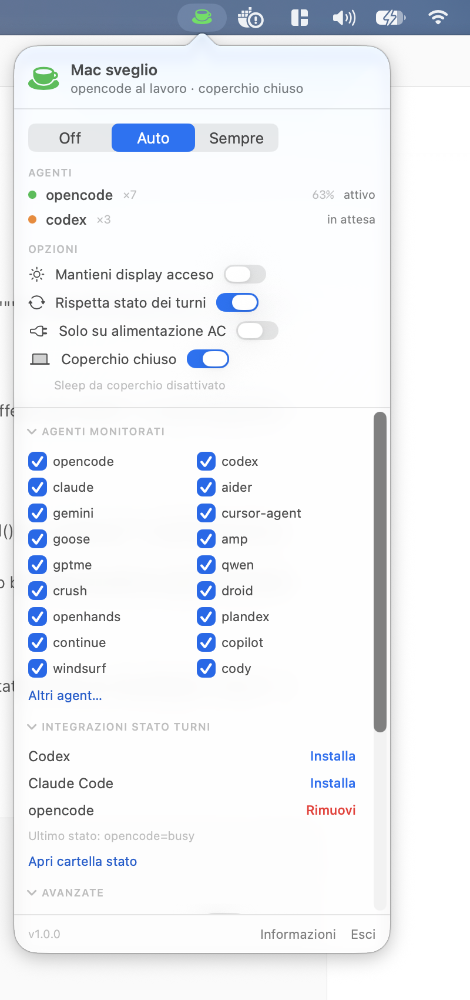

# Ephedrine

A macOS menu bar app that keeps your Mac awake **while AI coding agents are actually working** —
and lets it sleep when they are idle.

Classic keep-awake utilities (Caffeine, Amphetamine, `caffeinate`, …) hold a power assertion for as
long as they are on, regardless of whether anything is happening. With long-running coding agents
(opencode, Codex, Claude Code, aider, …) that is the wrong granularity in both directions: the Mac
falls asleep mid-run when you forget to enable them, or stays awake for hours while the agent is
just waiting for your next prompt.

Ephedrine sits in between: it detects agent processes, understands their **turn lifecycle**
(busy = generating, idle = waiting for input) through native integrations, and keeps the Mac awake
only while work is in progress.


---

## Features

- **Turn-state aware** — opencode, Claude Code and Codex report turn start/end to Ephedrine
  through their own official extension points (plugin / hooks / notify). No polling of log files.
- **CPU + process fallback** — agents without an integration are classified by process presence
  and CPU usage, so nothing is missed.
- **Grace period** — after the last activity the Mac stays awake for a configurable grace window
  (default 2 minutes), so short gaps never interrupt a run.
- **Closed-display mode** — optionally disable lid-close sleep (`pmset disablesleep`) while working,
  with a one-time admin install and automatic restore.
- **Fully automatic or manual** — `Auto`, `Sempre` (always on) and `Off` modes.
- **Optional auto-off timer** — in `Sempre` mode you can cap how long the Mac is kept awake
  (15 min … 4 h, or unlimited), so a forgotten "always on" cannot drain the battery forever.
- **Safety rails** — AC-only mode, prevent-display-sleep, simulate user activity (no screensaver/lock),
  crash-safe restoration of the lid setting.
- **Zero background services** — a single accessory app; no Dock icon, no windows, no daemons.
- **Scriptable** — the same binary is a CLI (`--report`, `--install-integration`, `--dump-agents`).

---

## Requirements

- macOS 14 or later (Apple Silicon or Intel)
- Xcode Command Line Tools (Swift 5.9+; developed with Swift 6.x)
- Optional: an agent with a supported integration (opencode / Claude Code / Codex)

---

## Build & install

```bash
git clone <your-fork-url> Ephedrine
cd Ephedrine

make app        # builds build/Ephedrine.app (release, ad-hoc signed)
make run        # builds and launches it
make install    # copies the app to /Applications and launches it
```

Manual equivalent:

```bash
swift build -c release
CONFIG=release ./scripts/build-app.sh   # wraps the binary into Ephedrine.app + Info.plist
open build/Ephedrine.app
```

The app is a menu bar accessory: after launching you will find the cup icon in the status bar.
To start it automatically, enable **Avvia al login** in the popover (requires the app to live in
`/Applications`).

---

## Menu bar icon

| Icon | Meaning |
|---|---|
| Green filled cup | Keeping the Mac awake — at least one agent is working |
| Orange hourglass | Grace period — work just finished, Mac stays awake for the remaining seconds |
| White outline cup | Standby — armed, but nothing is working (the Mac may sleep) |
| Dimmed outline cup | Mode `Off` |

---

## How it works

### 1. Power assertions (IOKit)

While the Mac must stay awake, Ephedrine holds `PreventUserIdleSystemSleep`
(equivalent to `caffeinate -i`). Optional extras:

- `PreventUserIdleDisplaySleep` — keeps the display on (`caffeinate -d`);
- `PreventSystemSleep` — system-level prevention, AC only (`caffeinate -s`);
- `IOPMAssertionDeclareUserActivity` — periodic "user activity" declaration to keep the
  screensaver/lock away (`caffeinate -u`).

The assertion name is visible in `pmset -g assertions` and reflects the current reason, e.g.
`Ephedrine - agent attivi: opencode, codex`. Assertions are owned by the process, so a crash
can never leave the Mac permanently awake.

### 2. Agent detection

Every 1–10 s (default 2 s) Ephedrine scans the process table with read-only syscalls:

1. **name + executable path** match against the configured patterns;
2. for wrapper interpreters (`node`, `bun`, `python3`, `npm`, …) the **full command line** is read
   via `KERN_PROCARGS2` and matched against every argument.

Short patterns (≤ 4 characters, e.g. `amp`) must match a whole token to avoid false positives;
utility processes (`grep`, `rg`, `ps`, editors, …) are ignored entirely.

CPU usage per process comes from `proc_pid_rusage` deltas (converted through the mach timebase —
Apple Silicon reports those counters in timebase units, not nanoseconds).

### 3. Turn state (busy / idle)

Integrations write tiny JSON files to:

```
~/Library/Application Support/Ephedrine/state/
```

```json
{ "agent": "opencode", "pid": 98373, "state": "busy", "reports_busy": true, "updated": 1789673906 }
```

Files older than 30 minutes are deleted automatically. Files whose pid is gone are no longer
matched at pid level but are kept (up to 30 minutes) as an agent-level fallback, so a `busy`
state survives an agent/helper restart mid-turn. The `reports_busy` flag tells Ephedrine
whether the integration reports **both** transitions (opencode plugin, Claude Code hooks) or
**only the end of a turn** (Codex `notify`).

### 4. Decision rules

| Situation | Classification |
|---|---|
| state `busy` | working |
| state `idle` + integration reports busy too | waiting (authoritative) |
| state `idle` + integration reports idle-only (Codex) | CPU ≥ 5 % ⇒ working, else waiting |
| no state, `Rispetta stato dei turni` on | CPU ≥ 5 % ⇒ working, else waiting |
| no state, `Solo con CPU attiva` on | CPU ≥ 3 % ⇒ working, else waiting |
| no state, both off | process presence ⇒ always working |

After the last "working" observation the assertions stay engaged for the **grace period**
(default 120 s), which covers LLM thinking time and tool restarts. In `Auto` mode the Mac is
released when every agent is waiting.

---

## Agent integrations

Install/remove them from the popover (**Integrazioni stato turni**) or via CLI:



```bash
/Applications/Ephedrine.app/Contents/MacOS/Ephedrine --install-integration opencode
/Applications/Ephedrine.app/Contents/MacOS/Ephedrine --uninstall-integration opencode
```

Every integration creates a `.ephedrine-backup` copy of the modified file the first time, and
uninstall restores the previous state (for Codex the original `notify` line is preserved verbatim
in a comment and restored on removal).

> The **path of the running binary is embedded** in the generated hook/plugin. If you move the app
> (e.g. from `build/` to `/Applications`), reinstall the integration from the new location.

### opencode

- File: `~/.config/opencode/plugin/ephedrine.ts` (respects `XDG_CONFIG_HOME`)
- Mechanism: an official plugin subscribed to the server event bus.
- Events used:
  - `session.status` (`busy` / `idle` / `retry`) — authoritative state;
  - `session.idle` — end-of-turn alias;
  - `message.part.delta` / `message.part.updated` — streaming tokens ⇒ busy;
  - `message.updated` — busy only for assistant messages without `time.completed` (late updates
    also arrive *after* `session.idle` and must not resurrect the busy state).
- Parallel sessions are tracked individually: the agent is reported idle only when the last
  session finishes.
- Restart opencode (or the OpenCode desktop app) after installing so the plugin is loaded.

### Claude Code

- File: `~/.claude/settings.json`
- Hooks added: `UserPromptSubmit` → `--report busy`, `Stop` → `--report idle`. Existing hooks are
  preserved.

### Codex

- File: `~/.codex/config.toml`
- Codex can only notify at the **end** of a turn (`agent-turn-complete`), so the integration
  installs `notify = ["…/Ephedrine", "--report", "idle", "--agent", "codex", "--idle-only"]`
  and Ephedrine combines it with the CPU heuristic to detect the start of the next turn.
- If a `notify` program is already configured (for example Codex Computer Use), it is **wrapped,
  not replaced**: Ephedrine writes the state and then re-executes the original program with
  its arguments via `--passthrough`, so nothing breaks.

### Any other agent

Add one or more patterns in **Agenti monitorati → Altri agent…** (comma separated). Without an
integration, the agent is classified by CPU activity; if you want the classic "as long as the app
is open" behaviour for it, disable **Rispetta stato dei turni**.

You can also report state yourself from any script/daemon:

```bash
"/Applications/Ephedrine.app/Contents/MacOS/Ephedrine" --report busy --agent my-agent
"/Applications/Ephedrine.app/Contents/MacOS/Ephedrine" --report idle --agent my-agent
```

---

## Closed-display mode (lid closed)

Closing the lid always sleeps a MacBook unless it is in clamshell mode (external display + power).
No power assertion can prevent it; the only supported switch is `pmset -a disablesleep 1`, which
requires root.

Ephedrine can manage it for you: enable **Coperchio chiuso** in the popover and enter your
admin password once. This installs:

```
/usr/local/bin/ephedrine-display     root:wheel 0755   (on|off|status)
/etc/sudoers.d/ephedrine             root:wheel 0440   NOPASSWD for the helper only
```

From then on the app toggles `disablesleep` silently (only while agents are working) and restores
it automatically when work stops, when the feature is turned off, when the app quits, and on the
next launch after a crash or force quit. Remove everything with **Avanzate → Rimuovi supporto
coperchio chiuso…**.

> With `disablesleep` active the Mac really stays on with the lid closed — watch out for heat in a
> bag and battery drain. Enabling **Solo su alimentazione AC** is recommended.

---

## CLI reference

| Command | Description |
|---|---|
| `Ephedrine` | Starts the menu bar app |
| `Ephedrine --report busy\|idle --agent <name> [--pid N] [--idle-only] [--passthrough <prog> <args…>]` | Writes a state file for the invoking agent (used by integrations) |
| `Ephedrine --install-integration <codex\|claude\|opencode>` | Installs the integration |
| `Ephedrine --uninstall-integration <codex\|claude\|opencode>` | Removes the integration |
| `Ephedrine --dump-agents` | Prints detected processes, CPU and session states (debugging) |

`--report` attributes the state automatically by walking the parent process chain looking for a
process whose name matches `--agent`, or accepts an explicit `--pid`.

---

## Settings reference

Preferences live in the `local.maurizio.Ephedrine` domain (also editable from the shell):

| Key | Default | Meaning |
|---|---|---|
| `mode` | `auto` | `off` / `auto` / `always` |
| `maxDuration` | `0` | Seconds cap for `always` mode (`0` = unlimited) |
| `respectSessionState` | `true` | Use busy/idle state from integrations |
| `requireCPUActivity` | `false` | Explicit CPU-only classification |
| `preventDisplaySleep` | `false` | Keep the display awake too |
| `preventSystemSleepOnAC` | `false` | Also hold `PreventSystemSleep` on AC |
| `simulateActivity` | `false` | Reset screensaver/lock idle timers |
| `activityInterval` | `60` | Seconds between activity declarations |
| `gracePeriod` | `120` | Seconds of keep-awake after the last activity |
| `onlyOnAC` | `false` | Do nothing while on battery |
| `pollInterval` | `2` | Seconds between monitor ticks |
| `customPatterns` | `[]` | Extra process patterns |
| `disabledPatterns` | `[]` | Built-in patterns turned off |
| `closedDisplayMode` | `false` | Closed-display mode enabled |
| `closedDisplayEngaged` | `false` | Internal: `disablesleep` currently set by the app |
| `sessionStartedAt` | `0` | Internal: start of the current `always` session (epoch s) |

```bash
defaults write local.maurizio.Ephedrine gracePeriod -float 300
```

---

## Troubleshooting

**The Mac still sleeps while an agent is working** — the Mac stays awake only while Ephedrine
holds an assertion, so two things matter:

1. **The system sleep timer**: `pmset -g custom | grep sleep`. Values are in minutes — `sleep 1`
   means the Mac sleeps **one minute** after any release. If your timer is that aggressive,
   consider `sudo pmset -a sleep 10`, or raise the grace period.
2. **The turn-state signal**: run `Ephedrine --dump-agents` while the agent is working; its
   process should report `state=busy`. State files survive helper restarts and dead pids
   (agent-level fallback, up to 30 minutes), so a long network-bound inference can no longer be
   mistaken for idleness when an integration is installed.

**The icon never changes** — check that the agent actually reports state:
`Ephedrine --dump-agents` shows a `state=` column. `-` means "no integration" and the CPU
fallback applies (an idle agent at ~0 % CPU keeps nothing awake — by design).

**The Mac still sleeps with the lid closed** — closed-display mode must be enabled and the helper
installed; verify with `pmset -g | grep SleepDisabled` (should print `SleepDisabled 1` while
working) and `pmset -g assertions | grep Ephedrine`.

**Integrations stopped working after moving the app** — reinstall them: the hook/plugin contains
the absolute path of the binary.

**A stale `disablesleep 1`** — run `sudo pmset -a disablesleep 0`, or remove and reinstall the
support from the popover; the app also repairs this automatically at launch.

**Inspect what the app holds**

```bash
pmset -g assertions | grep -A2 Ephedrine
ls ~/Library/Application\ Support/Ephedrine/state/
```

---

## Project layout

```
Sources/Ephedrine/
  App.swift               CLI/GUI entry point (reporter, utilities, menu bar app)
  AppDelegate.swift       Monitor loop, decision logic, status item, popover actions
  MenuModel.swift         Observable view model for the popover
  MenuView.swift          SwiftUI popover UI
  AgentDetector.swift     Process scanning, pattern matching, CPU sampling
  SessionState.swift      Turn-state files (store, reader, reporter CLI, diagnostics)
  Integrations.swift      opencode plugin / Claude hooks / Codex notify install & uninstall
  PowerManager.swift      IOKit power assertions + AC detection
  ClosedDisplayHelper.swift  Privileged helper for lid-close sleep (pmset disablesleep)
  Settings.swift          Typed UserDefaults access
scripts/build-app.sh      Builds the .app bundle (Info.plist, ad-hoc signature)
```

Data flow:

```
agent (opencode/codex/claude) ──hook/plugin──▶ Ephedrine --report ──▶ state/*.json
                                                                              │
        tick (2 s) ──▶ detect processes + read states ◀──────────────────────┘
                    ──▶ classify (busy/idle/CPU) ──▶ power assertions (IOKit)
                                                 └─▶ lid-close sleep (pmset)
```

---

## Development

```bash
swift build                 # debug build
swift build -c release      # release build
./.build/debug/Ephedrine --dump-agents    # inspect detection without the GUI
```

The UI strings are currently Italian; the code and comments are in English. Localization PRs are
welcome.

---

## License

MIT — see [LICENSE](LICENSE).
