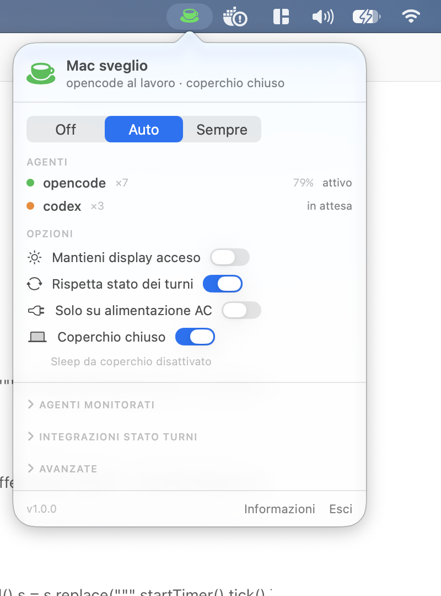

# Ephedrine

**Keep your Mac awake only while AI coding agents are actually working — and let it sleep when they are idle.**

Ephedrine is a tiny macOS menu bar app. Classic keep-awake utilities (Caffeine, Amphetamine,
`caffeinate`, …) hold a power assertion for as long as they are on, regardless of whether anything
is happening. With long-running coding agents (opencode, Codex, Claude Code, pi, …) that is the
wrong granularity: the Mac falls asleep mid-run when you forget to enable them, or stays awake for
hours while the agent is just waiting for your next prompt.

Ephedrine sits in between: it detects the agent processes, understands their **turn lifecycle**
(busy = generating, idle = waiting for input) through native integrations, and keeps the Mac awake
only while work is in progress.

## Highlights

- **Turn-state aware** — opencode, Claude Code, Codex and pi report turn start/end to Ephedrine
  through their own official extension points (plugin / hooks / extension / notify). No log scraping.
- **CPU + process fallback** — agents without an integration are classified by process presence and
  CPU usage, so nothing is missed.
- **Grace period** — after the last activity the Mac stays awake for a configurable window
  (default 2 minutes), so short gaps never interrupt a run.
- **Lid-closed mode** — optionally disable lid-close sleep (`pmset disablesleep`) while working,
  with a one-time admin install and automatic restore.
- **Safety rails** — AC-only mode, prevent display sleep, simulate user activity (no screensaver /
  lock), crash-safe restoration.
- **Zero background services** — a single accessory app; no Dock icon, no windows, no daemons.
- **Scriptable** — the same binary is a CLI (`--report`, `--install-integration`, `--dump-agents`).
- **Localized** — English, Italian, Spanish, French, German, Portuguese, Dutch, Polish, Russian,
  Turkish, Chinese (Simplified & Traditional), Japanese, Korean.

## Where to go next

- **[Installation](installation.md)** — download the app and get past Gatekeeper, or build it yourself.
- **[Interface](interface.md)** — the menu bar icon and every control in the popover.
- **[Modes](modes.md)** — `Off`, `Auto` and `Always`, plus the run limit.
- **[Agent detection](detection.md)** — how processes, CPU and patterns work.
- **[Agent integrations](integrations.md)** — turn-state for opencode, Claude Code, Codex, pi and custom agents.
- **[Lid-closed mode](closed-display.md)** — keep working with the lid shut.
- **[Advanced options](settings.md)** — every preference and its `defaults` key.
- **[CLI](cli.md)** — the command-line interface.
- **[Troubleshooting](troubleshooting.md)** and **[FAQ](faq.md)** — when something is off.
- **[Development](development.md)** — build, architecture and localization.

## At a glance

| | |
|---|---|
| Platform | macOS 14 or later (Apple Silicon or Intel) |
| Distribution | Universal `.app` (ad-hoc signed) on the [Releases page](https://github.com/mizio85/ephedrine/releases) |
| Telemetry | None |
| Privileges | None, except the optional lid-closed helper (one-time admin prompt) |
| License | MIT |
